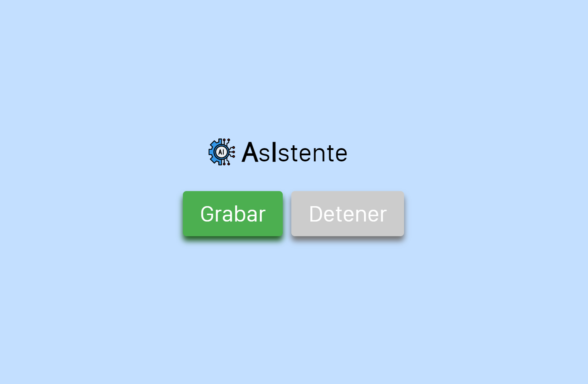
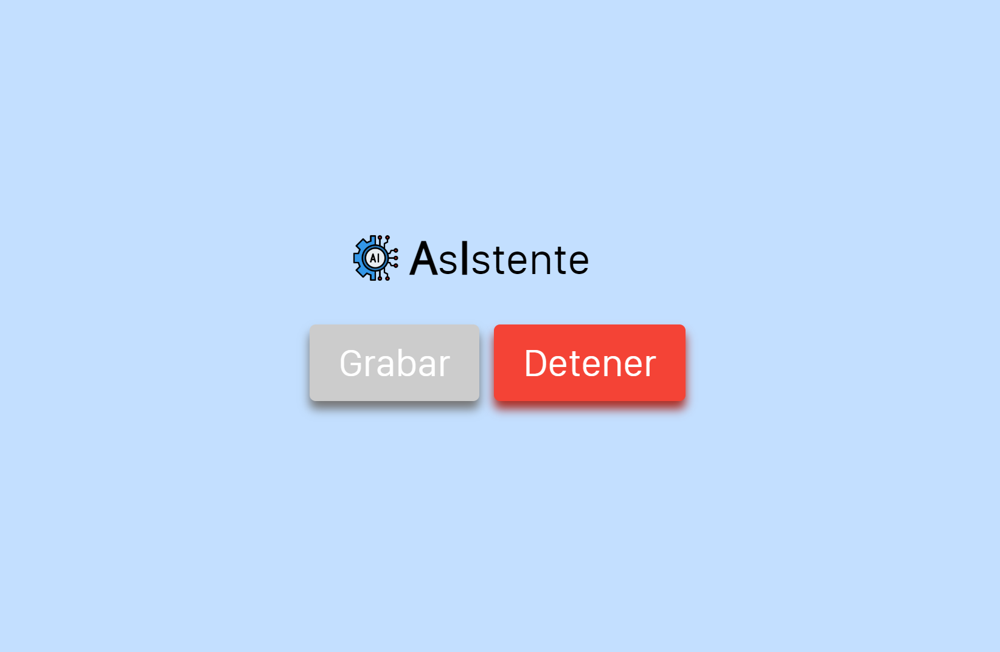
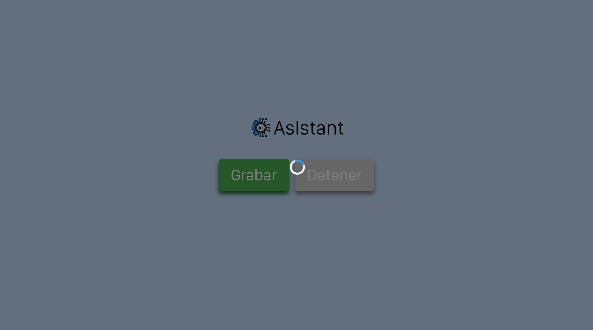
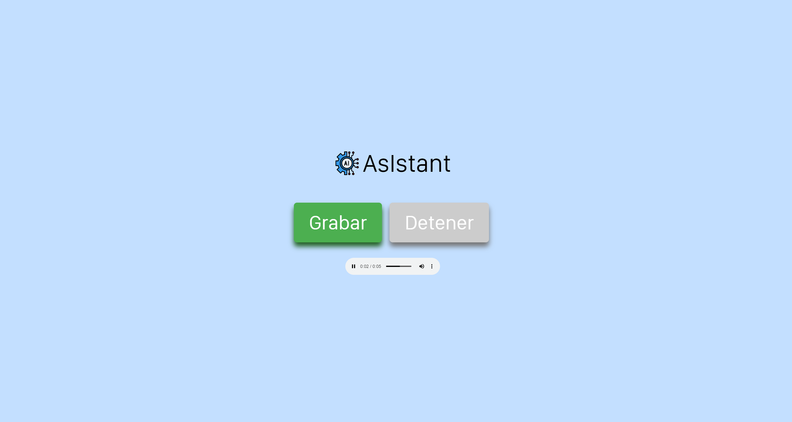

# AsIstant [en]

A simple project about the use of various technologies to achieve a voiceBot that answers our questions.

To do this we will mainly use 3 technologies:

* **Whisper**, a library by OpenAI that can transcribe audio in different languages.
* **ChatGPT**, the well known chatBot also from OpenAI, we use it through its API (paid but very cheap).
* **TTS**, a library by Coqui created to read text like humans, it outperforms Google's gTTS (also used in this project) but it doesn't have all languages available so we are only useing it for English and Spanish.

For the interfacer it has a simple web managed directly with Flask library in python.


### INSTALL:

It is necessary to have python installed and then we will install the libraries we need with:

```
pip3 install -r requirements.txt
```

This can take a few minutes, after that, we need to modify the "claves.json" file to add our OpenAI API key, you can get it from [OpenAI](https://platform.openai.com/account/api-keys), but you must have a payment method configured. The cost after a few hours of use was around 0.01$ so we should not be worried about it.

Finally, we run the "app.py" file wich will creat the server by default on [localhost:5000](http://127.0.0.1:5000).

### USE:

The web is quite intuitive, when you click on "Grabar" button it starts to record, when you click on "Detener" it will stop. After this we must wait for the process to complete (first time it may take several minutes because it has to download all the models) and then it will play the audio with the answer.

---

# AsIstant [es]

Un proyecto sencillo consistente en el uso de diversas tecnologías para lograr un voiceBot que conteste a nuestras preguntas.

Para ello usaremos principalmente 3 tecnologías:

* **Whisper**, una librería de OpenAi que puede transcribir conversaciones en distintos idiomas.
* **ChatGPT**, el más que conocido chatBot de OpenAi, lo usaremos mediante su API (es de pago pero bastante económica).
* **TTS**, una librería de la startup Coqui, creada para leer texto de forma más similar a los humanos, mejora a la librería gTTS de Google (la cual también usamos en este proyecto) pero con el inconveniente de no tener tantos idiomas disponibles.

En la parte de la interfaz tenemos una web simple gestionada directamente con python mediante la librería Flask.


### INSTALACION:

Para que funcione el proyecto es necesario tener instalado python, con el cual instalaremos las librerías que necesitamos:

```
pip3 install -r requirements.txt
```

Esto puede tardar unos minutos, tras ello, necesitamos modificar el archivo "claves.json" para añadir nuestra clave de la API de OpenAi, se puede obtener en [OpenAI](https://platform.openai.com/account/api-keys), pero se debe tener un metodo de pago activo. El gasto aproximado tras unas horas de uso fué de 0.01€, por lo que no debería preocuparnos en exceso.

Finalmente, ejecutamos el archivo "app.py", lo cual creará el servicio web por defecto en [localhost:5000](http://127.0.0.1:5000).

### USO:

La web es bastante intuitiva, al pulsar en el boton de "Grabar" comienza a escucharnos, y al pulsar en "Detener" parará. Tras esto debemos esperar a que se procese (la primera vez puede tardar varios minutos debido a que tiene que descargar todos los modelos) y despues se nos reproducirá el audio con la respuesta.


---


# Web








